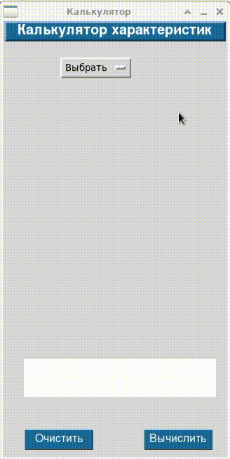

# Geometric Calculator

Калькулятор характеристик геометрических фигур

## Особенности

- постановка задачи:

При помощи ООП спроектировать и реализовать геометрический калькулятор

для вычислений, производимых над фигурами. Калькулятор должен поддерживать вычисления для плоских и объемных фигур.

Плоские фигуры: круг, квадрат, прямоугольник, треугольник, трапеция, ромб.

Объемные фигуры: сфера, куб, параллелепипед, пирамида, цилиндр, конус.

Реализовать как минимум один общий метод вычисления для всех фигур и как минимум один специфичный для определенных фигур. Например, площадь – общий метод для всех фигур, медиана – специфичный метод для ряда фигур.

Необходимо: реализовать графический интерфейс для возможностей взаимодействия пользователя с программой и визуализации фигур (с учетом введенных параметров фигуры).

- статус проекта: учебный, pet, стартап и проч.

## Пример работы




\* Валидация значений параметров фигур(ы) не предусмотрена;

результирующее значение представляется с точностью до 8 знаков.

### Используемые технологии

* [tkinter](https://docs.python.org/3/library/tkinter.html#module-tkinter)

## Требования к окружению

* Python 3.9 и выше,
* Linux/Windows,
* Переменные окружения (ПеО).

Проект настраивается через ПеО, достаточно указать их в файле `.env`.
Передача значений ПеО происходит с использованием [environs](https://pypi.org/project/environs/).

## Установка

- Клонировать проект:
```sh
git clone https://github.com/Padking/geometric-calculator.git
cd geometric-calculator/
```
- Создать каталог виртуального окружения (ВО)*,
   связать каталоги ВО и проекта,
   установить зависимости:
```sh
mkvirtualenv -p <path to python> <name of virtualenv>
setvirtualenvproject <path to virtualenv> <path to project>
pip install -r requirements.txt
```
- Запустить программу:
```sh
cd geometric-calculator/calculator
python calculator.py
```


\* с использованием [virtualenvwrapper](https://virtualenvwrapper.readthedocs.io/en/latest/index.html)
